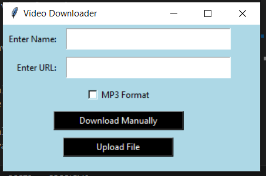

# YouTube Video Downloader and Converter

This script downloads videos from YouTube using `yt_dlp`, converts them to MP3 using `moviepy`, and optionally deletes the downloaded MP4 files.

## Requirements

- Python 3.x
- `yt_dlp` library
- `moviepy` library
- `tkinter` library (usually comes with Python)

## Installation

1. Clone this repository or download the script files.
2. Create and activate a virtual environment:

    ```sh
    # Create a virtual environment
    python -m venv venv

    # Activate the virtual environment (Windows)
    venv\Scripts\activate

    # Activate the virtual environment (macOS/Linux)
    source venv/bin/activate
    ```

3. Install the required libraries:

    ```sh
    pip install yt_dlp moviepy
    ```

## Usage

1. Create a `videos_to_download.txt` file with the following format:

    ```
    name1|https://example.com/video1
    name2|https://example.com/video2
    name3|https://example.com/video3
    ```

    Each line should contain the name and URL of the video, separated by a `|` character.

## GUI Usage

To run the GUI version, simply run:

```sh
python main.py
```

The GUI allows you to manually enter video details or upload a text file with video details in the same format as described above.

## Functions

### `MP4ToMP3(mp4, mp3)`

Converts an MP4 file to MP3 format.

- `mp4`: Path to the input MP4 file.
- `mp3`: Path to the output MP3 file.

### `download(url, name, mp3_format=False)`

Downloads a video from a specified URL and optionally converts it to MP3.

- `url`: The URL of the video to download.
- `name`: The name of the output file.
- `mp3_format`: If `True`, converts the video to MP3 format after downloading.

### `delete_mp4_files(directory)`

Deletes all MP4 files in a specified directory.

- `directory`: Path to the directory containing the MP4 files to delete.

## Example

Here is an example of the `videos_to_download.txt` file:

```plaintext
my_video|https://www.youtube.com/watch?v=dQw4w9WgXcQ
another_video|https://www.youtube.com/watch?v=3JZ_D3ELwOQ
```

Run the script:

```sh
python main.py
```

## App:



## Notes

- Ensure that the `./Outputs` directory exists before running the script, or create it manually.
- It's best practice to use a virtual environment to avoid conflicts with other Python projects on your system.
- This script is for educational purposes and should be used responsibly, following YouTube's terms of service.